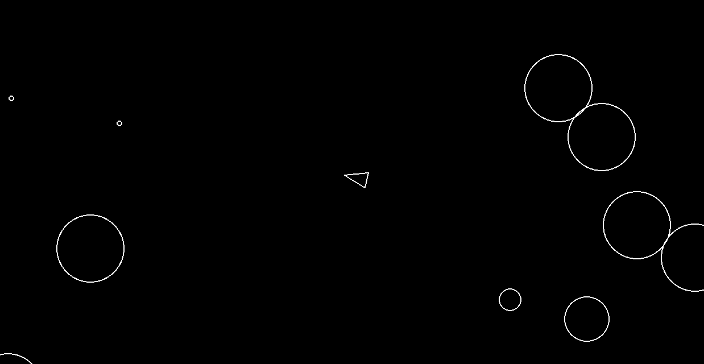

# Asteroids

A classic arcade-style Asteroids game built using Python and Pygame.



## Description

I built this project to practice Python, Object-Oriented Programming, and game development fundamentals in a fun/classic way. 
Like in the original, this game features a player-controlled ship, randomly spawning asteroids, and shooting mechanics.

## Installation
1. Ensure you have [Python 3](https://www.python.org/) installed.
2. Clone this repository:
   ```bash
   git clone https://github.com/clarencegabrielong/asteroids.git
   ```
3. Install the dependencies:
    ```bash 
    pip install pygame
    ```

## How to Play

Run the game:
```bash
python3 main.py
```

### Controls

| Action | Key |
|--------|-----|
| Move forward | W |
| Move backward | S |
| Rotate left | A |
| Rotate right | D |
| Fire weapon | Space |
